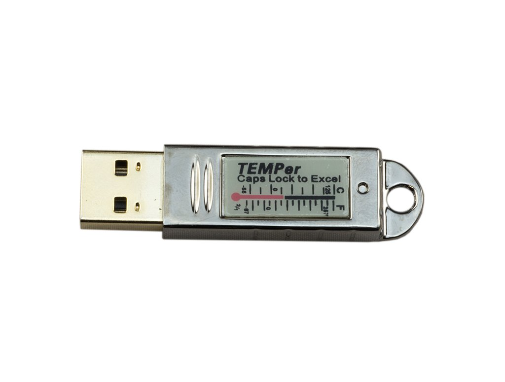

# Temper_exporter

## Configuration

This is exporter for usb device **[413d:2107]**

```bash
systemctl enable temper_exporter
systemctl start temper_exporter
```

You can change value in /etc/default/temper

```plane
TF - Factor for temperature 
TO - Offset for temperature
HF - Factor for humidity
HO - Offset for humidity
```

Default port - 9112

Get metrics

```bash
curl http://localhost:9112/metrics
```

```plane
* # HELP temperx_humidity The humidity
* # TYPE temperx_humidity gauge
* temperx_humidity 200
* # HELP temperx_temperature The temperature
* # TYPE temperx_temperature gauge
* temperx_temperature 25.00
```

## Supported Devices

In the following table "I" means the sensor is internal to the USB stick and "E" means the sensor is on a cable that is plugged into the USB stick.
  

|  Product  |    Id     |    Firmware     | Temp | Hum |     Notes     |
| --------- | --------- | --------------- | ---- | --- | ------------- |
| TEMPer    | 413d:2107 | TEMPerGold_V3.1 | I    |     | Metal         |
| TEMPerHUM | 413d:2107 | TEMPerX_V3.1    | I    | I   | White plastic |
| TEMPer2   | 413d:2107 | TEMPerX_V3.3    | I,E  |     | White plastic |
| TEMPer1F  | 413d:2107 | TEMPerX_V3.3    | E    |     | White plastic |

[Get binary](https://www.google.com)
